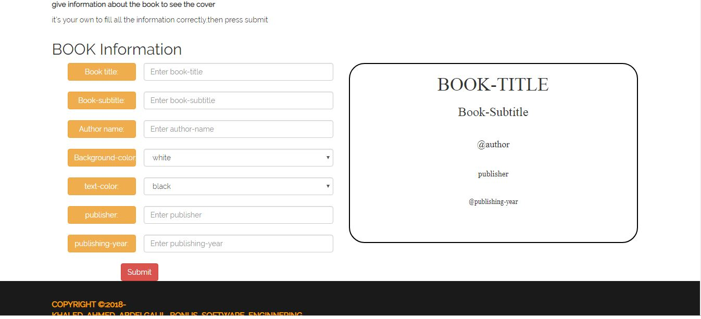

###  This a simple client server webpage that takes inputs from user and makes a simple book-cover and it's an assigment related to software enginnering subject.

##like this:

###it also handles when an field is empty

###also handles when title-subtitle-..... is very big to be put in cover

